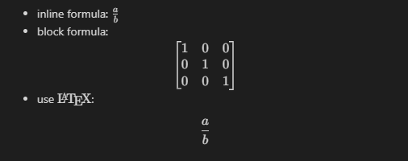

# Asciimath for Markdown Preview

## Features

Add [asciimath](https://github.com/zmx0142857/asciimathml) support for VSCode's built-in markdown preview.

- tutorial & reference: https://zmx0142857.github.io/note/#math
- original homepage: http://asciimath.org/

## Settings

- `markdown-asciimath.blockLabel`: Label name for block formula
- `markdown-asciimath.inlineDelimLeft`: Left Delimiter for inline formula (Not supported yet)
- `markdown-asciimath.inlineDelimRight`: Right Delimiter for inline formula (Not supported yet)
